# ArUco-Guided FLIP Segmentation

**A marker-anchored, point-prompted object segmentation pipeline: detect an ArUco marker, use its center as a point prompt, segment the object with FLIP — benchmarked against a public COCO-trained detector on novel bottle shapes.**

[](LICENSE)
[](https://arxiv.org/pdf/2502.02763)
[](https://github.com/CognitiveModeling/FLIP)

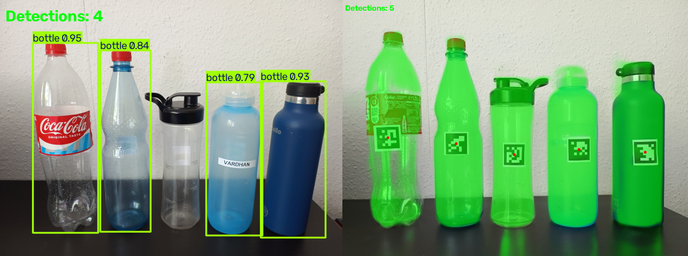

---

## The Problem

General-purpose object detectors and segmentation models are trained on large, fixed-category datasets (e.g., COCO's ~120k images). That works well for common object shapes they've seen many examples of — but they routinely fail, or misclassify, when an object's shape falls outside their training distribution. A closed-set detector doesn't know it's looking at a "bottle" if that bottle doesn't resemble the bottles it was trained on.

This repo demonstrates two things side by side:

1. **A public, pretrained detector (YOLOv8, COCO-trained) fails or misfires on out-of-distribution bottle shapes.** It reliably finds standard bottles, but misses or misclassifies unusually shaped ones — a direct symptom of closed-set training.
2. **An ArUco marker + FLIP point-prompted segmentation pipeline segments any bottle shape reliably, needing only a single point prompt** (the marker's center) rather than category-specific training. A physical marker gives the system an unambiguous initial point of reference, and a lightweight object-centric model (FLIP) turns that single point into a full segmentation mask — no bottle-specific training required.

A natural extension (outside the scope of this repo) is removing the marker entirely once a system can predict its own object center from context — this pipeline is one building block toward that.

## Repo Structure

```
.
├── README.md
├── LICENSE
├── requirements.txt
├── baseline_yolo.py                # public-model baseline: YOLOv8 COCO-pretrained bottle detection
├── segment.py                      # core FLIP + ArUco pipeline (live webcam), also imported by segment_image_flip.py
├── segment_image_flip.py           # ArUco + FLIP segmentation — single photo or live webcam
├── media/
│   ├── photos/
│   │   ├── source/                 # raw input photos, no marker (bottle_1.jpg ... bottle_5.jpg)
│   │   ├── source_aruco/           # same bottles, with the ArUco marker stuck on (bottle_1_aruco.jpg ... bottle_5_aruco.jpg)
│   │   ├── baseline/               # YOLOv8 detection results (bottle_1_yolo.png ... bottle_5_yolo.png)
│   │   ├── flip/                   # ArUco + FLIP segmentation results (bottle_1_aruco_flip.png ... bottle_5_aruco_flip.png)
│   │   └── comparison_grid.png     # 4-panel side-by-side comparison figure
│   └── videos/
│       ├── baseline_live.mp4       # YOLOv8 live detection demo
│       └── flip_live.mp4           # ArUco + FLIP live segmentation demo
```

`FLIP-main/` (the original FLIP repository, its model weights, and its compiled C extension) is **not** vendored in this repo — see [Setup](#setup) below for how to obtain it.

## Setup

### 1. Clone this repo and create the environment

```bash
git clone https://github.com/Vardhan1303/aruco-flip-segmentation.git
cd aruco-flip-segmentation

conda create -n iphoreos python=3.11
conda activate iphoreos
pip install -r requirements.txt
```

### 2. Get FLIP itself

This project calls into [FLIP](https://github.com/CognitiveModeling/FLIP) (Traub & Butz, 2025) rather than reimplementing it. Clone it alongside this repo as `FLIP-main/`:

```bash
git clone https://github.com/CognitiveModeling/FLIP.git FLIP-main
```

Download the ONNX encoder/predictor weights (Tiny or Small recommended for real-time use) from the [original repo's model checkpoints table](https://github.com/CognitiveModeling/FLIP#-model-checkpoints) into:

```
FLIP-main/model/weights/flip-encoder-<size>.onnx
FLIP-main/model/weights/flip-predictor-<size>.onnx
```

### 3. Build FLIP's C extension

FLIP's patch-sampling step (`flip_position`) is a compiled C extension with no pure-Python fallback:

```bash
cd FLIP-main/ext
python setup.py build install
cd ../..
```

> Note: the extension's default build flags are GCC-style and will not compile with MSVC on native Windows. Build inside WSL2 (Ubuntu) or a Linux/macOS machine.

## Usage

### Baseline: public model (YOLOv8)

```bash
python baseline_yolo.py --mode photo --image media/photos/source/bottle_1.jpg
python baseline_yolo.py --mode live
```

### ArUco + FLIP segmentation

```bash
python segment_image_flip.py --mode photo --image media/photos/source_aruco/bottle_1_aruco.jpg --full-frame --sigma-x 0.1 --sigma-y 0.35
python segment_image_flip.py --mode live
```

(`segment.py` is used directly for the original live-webcam demo and is also imported by `segment_image_flip.py` for the shared FLIP/ArUco logic.)


## Results

### Source photos

| Without marker | With ArUco marker |
|---|---|
| 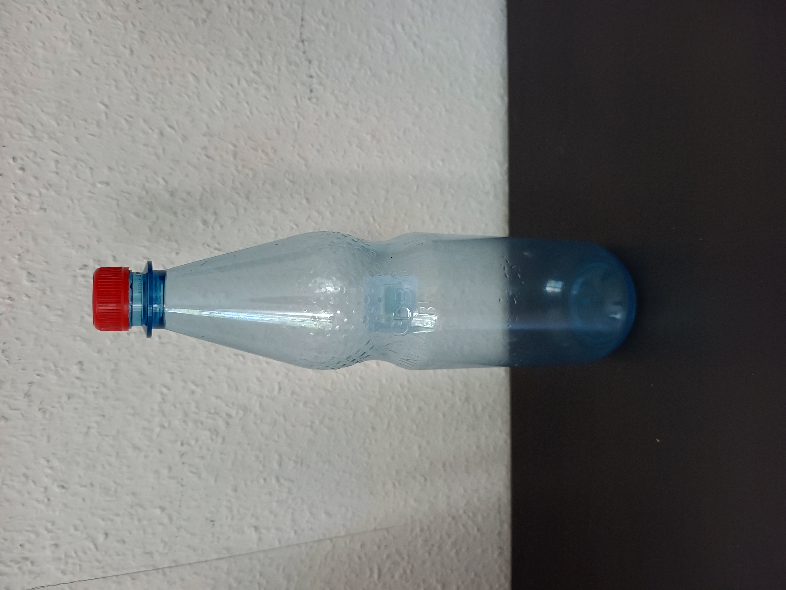 | 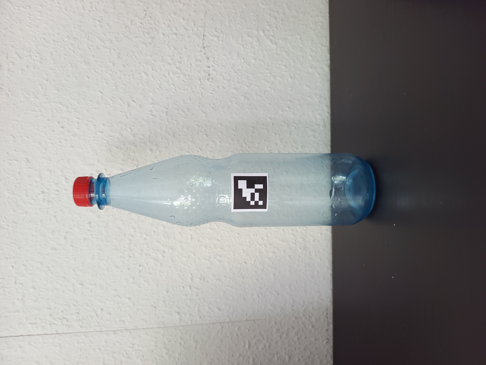 |

(one pair shown above; all 5 bottles' source photos are in `media/photos/source/` and `media/photos/source_aruco/`)

### Public model baseline (YOLOv8n, COCO-pretrained)

| Bottle 1 | Bottle 2 | Bottle 3 | Bottle 4 | Bottle 5 |
|---|---|---|---|---|
| 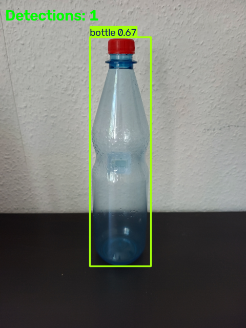 | 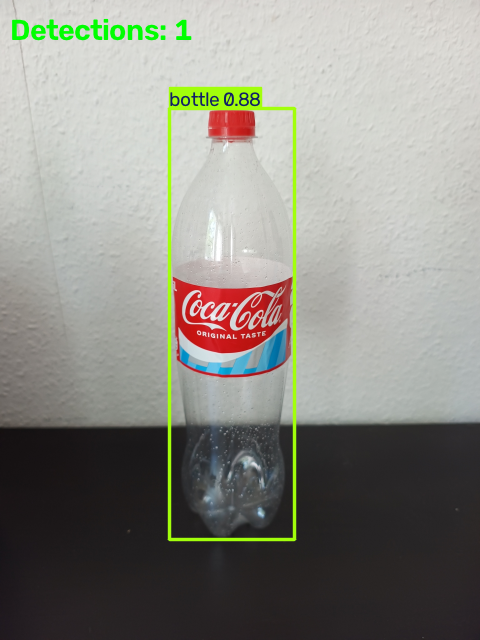 | 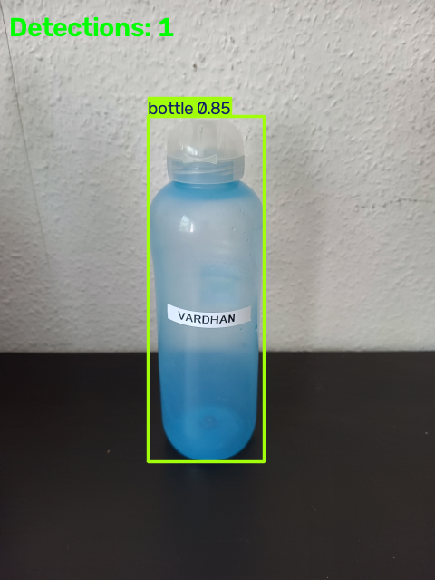 | 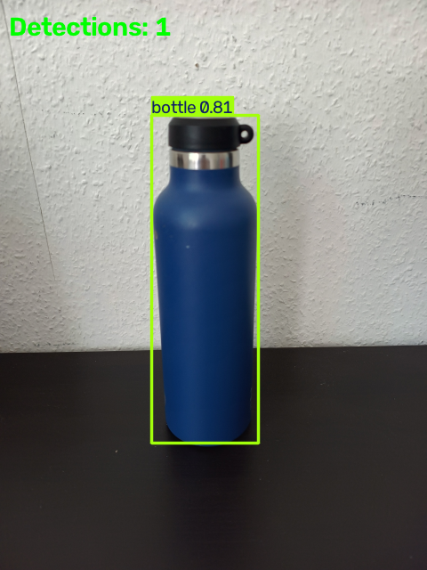 | 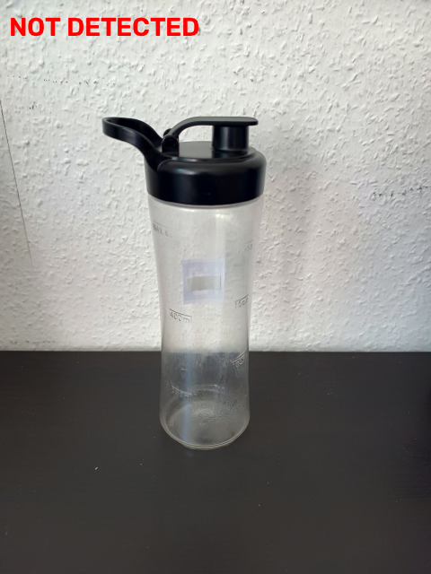 |

Live demo: [`media/videos/baseline_live.mp4`](media/videos/baseline_live.mp4)

Bottle 5 was **not detected** by the public model in either the photo or the live video — an out-of-distribution shape relative to COCO's training data.

### ArUco + FLIP segmentation

| Bottle 1 | Bottle 2 | Bottle 3 | Bottle 4 | Bottle 5 |
|---|---|---|---|---|
| 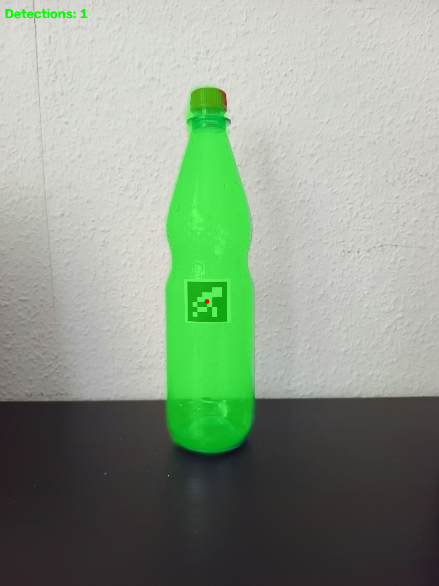 | 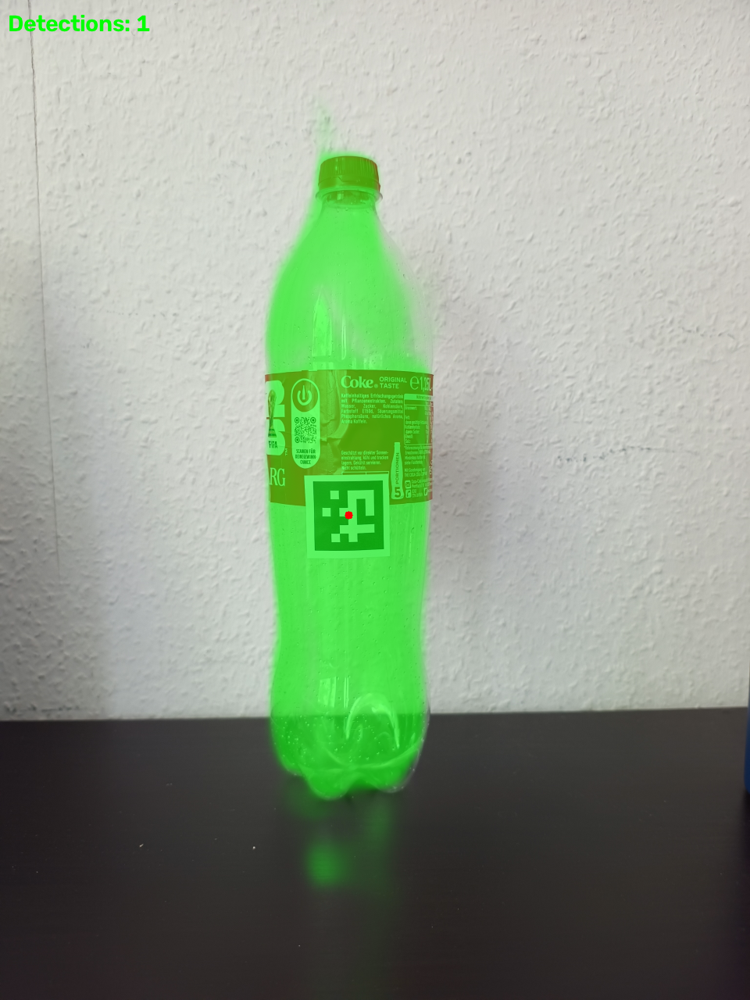 | 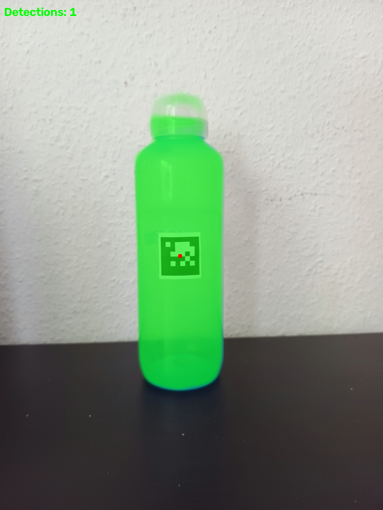 | 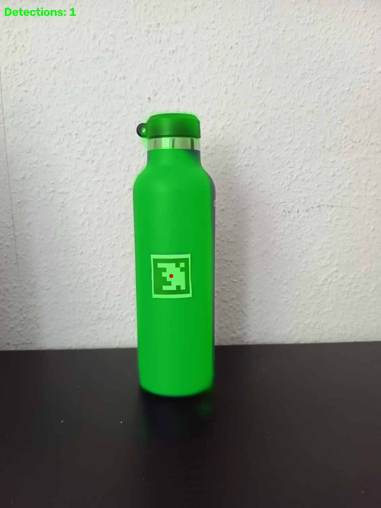 | 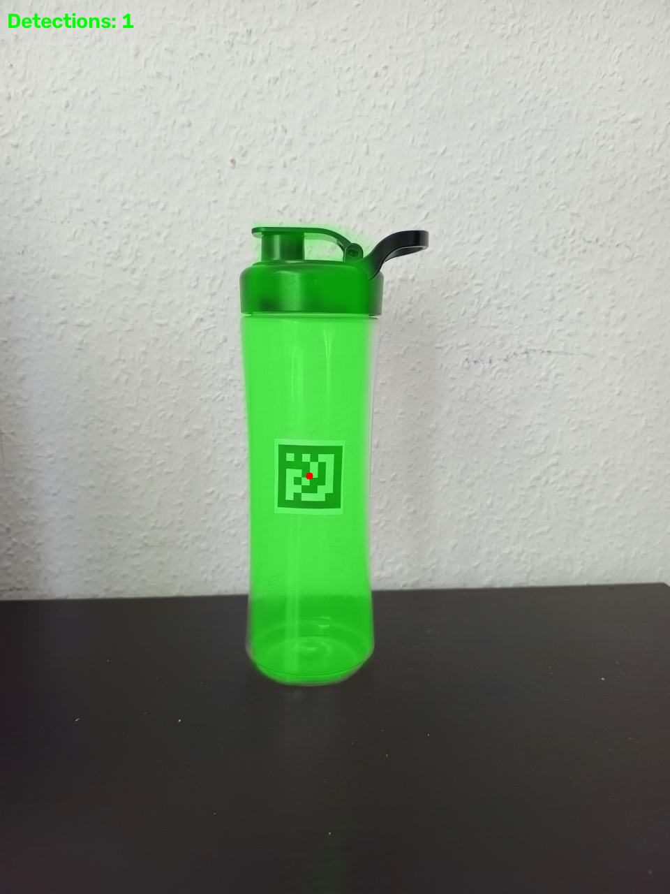 |

Live demo: [`media/videos/flip_live.mp4`](media/videos/flip_live.mp4)

All five bottles, including bottle 5, segmented correctly — the pipeline needs only the marker's center as a point prompt, with no bottle-specific training.

<table>
<tr>
<td align="center"><b>YOLOv8 (public model) — live</b></td>
<td align="center"><b>ArUco + FLIP — live</b></td>
</tr>
<tr>
<td><video src="https://github.com/user-attachments/assets/d6e921e2-5c14-410b-962b-632c873fc4af" controls width="100%"></video></td>
<td><video src="https://github.com/user-attachments/assets/7b3ee4f8-9f5a-4257-8d6d-95db645da50c" controls width="100%"></video></td>
</tr>
</table>

## Acknowledgments & Citation

This project depends on **FLIP (Fovea-Like Input Patching)**, developed by Manuel Traub and Prof. Martin V. Butz's group (Cognitive Modeling, University of Tübingen). No FLIP model code or weights are modified or redistributed here — only called via their published ONNX weights and C extension, per the original repo's instructions.

- Paper: [Looking Locally: Object-Centric Vision Transformers as Foundation Models for Efficient Segmentation](https://arxiv.org/pdf/2502.02763)
- Repo: [github.com/CognitiveModeling/FLIP](https://github.com/CognitiveModeling/FLIP)
- Project page: [cognitivemodeling.github.io/FLIP](https://cognitivemodeling.github.io/FLIP)

```bibtex
@article{traub2025flip,
  title={Looking Locally: Object-Centric Vision Transformers as Foundation Models for Efficient Segmentation},
  author={Traub, Manuel and Butz, Martin V},
  journal={arXiv preprint arXiv:2502.02763},
  year={2025}
}
```

FLIP's original work received funding from the Deutsche Forschungsgemeinschaft (DFG, German Research Foundation) under Germany's Excellence Strategy – EXC number 2064/1 – Project number 390727645, as well as from Cyber Valley in Tübingen, CyVy-RF-2020-15. The original authors thank the International Max Planck Research School for Intelligent Systems (IMPRS-IS) for supporting Manuel Traub, and the Alexander von Humboldt Foundation for supporting Martin Butz.

This baseline uses [Ultralytics YOLOv8](https://github.com/ultralytics/ultralytics) (AGPL-3.0), COCO-pretrained weights, for the public-model comparison.

## License

This repo's own code is licensed under the [MIT License](LICENSE). FLIP itself is separately MIT-licensed by its original authors — see [LICENSE](LICENSE) for both notices in full.
